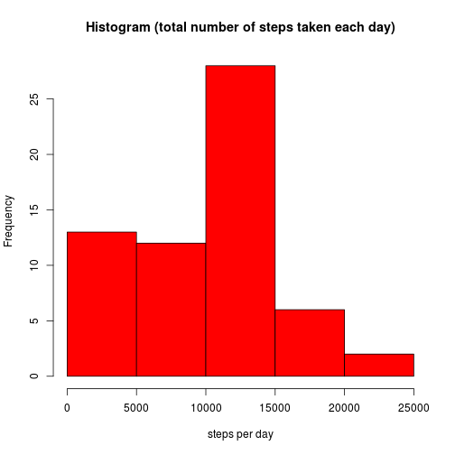
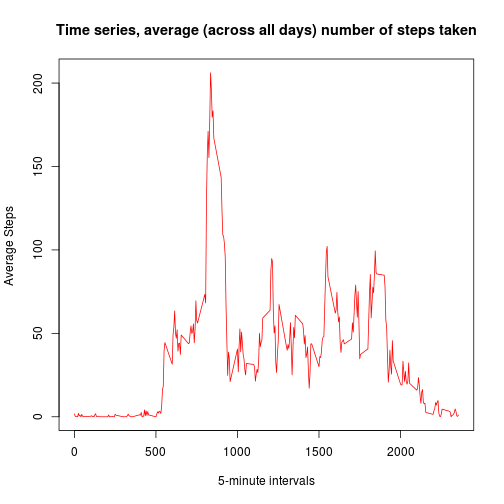
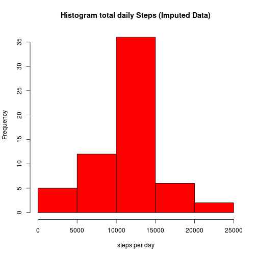

## Reproducible Research: Peer Assessment 1
## Loading and preprocessing the data

```r
#read raw data.
act <- read.table(unz("activity.zip", "activity.csv"), header=T, sep=",")
act$date <- as.character(act$date)
act$date <-as.Date(strptime(act$date,format="%Y-%m-%d",tz=""))
```

## What is mean total number of steps taken per day?

```r
dailyStepsTotal = tapply(act$steps, act$date, sum, na.rm = TRUE)
hist(dailyStepsTotal,xlab="steps per day" , ylab = "Frequency", col = "red",main = "Histogram (total number of steps taken each day)")
```

 

```r
meanTotalSteps <- mean(dailyStepsTotal)
```
####mean number of steps taken each day

```r
meanTotalSteps
```

```
## [1] 9354.23
```

```r
medianTotalSteps <- median(dailyStepsTotal)
```
####median number of steps taken each day

```r
medianTotalSteps
```

```
## [1] 10395
```


## What is the average daily activity pattern?

```r
timeIntervalStepsMean <- tapply(act$steps, act$interval, mean, na.rm = TRUE)
plotInterval <- unique(act$interval)
plot(plotInterval,timeIntervalStepsMean,type = "l",xlab="5-minute intervals" , ylab = "Average Steps ", col = "red",main = "Time series, average (across all days) number of steps taken")
```

 

####5-minute interval that, on average, contains the maximum number of steps (interval / average steps)

```r
maxActivityTimeInterval <- plotInterval[which.max(timeIntervalStepsMean)]
#maxActivityTimeInterval
timeIntervalStepsMean[as.character(maxActivityTimeInterval)]
```

```
##      835 
## 206.1698
```

## Imputing missing values
#### total rows with missing values are

```r
nrow(act[!complete.cases(act),])
```

```
## [1] 2304
```
### Data Imputing Strategy
#### Missing values of 'steps' are being replaced by the mean for that 5-minute interval over all days.

```r
for(i in 1:nrow(act)) {
  roww <- act[i,]
  if(is.na(roww$steps)) {
      roww$steps <- timeIntervalStepsMean[as.character(roww$interval)]  
      act[i,] <- roww
  }
}

imputeddailyStepsTotal = tapply(act$steps, act$date, sum, na.rm = TRUE)
```
#### Analysis of Imputed data (Histogram)

```r
hist(imputeddailyStepsTotal,xlab="steps per day" , ylab = "Frequency", col = "red",main = "Histogram total daily Steps (Imputed Data)")
```

 

#### Analysis of Imputed data (Mean number of steps taken each day )

```r
imputedmeanTotalSteps <- mean(imputeddailyStepsTotal)
imputedmeanTotalSteps
```

```
## [1] 10766.19
```

#### Analysis of Imputed data (Median number of steps taken each day )

```r
imputedmedianTotalSteps <- median(imputeddailyStepsTotal)
imputedmedianTotalSteps
```

```
## [1] 10766.19
```
#### after imputing data the mean and median values of steps taken each day have changed.

## Are there differences in activity patterns between weekdays and weekends?
